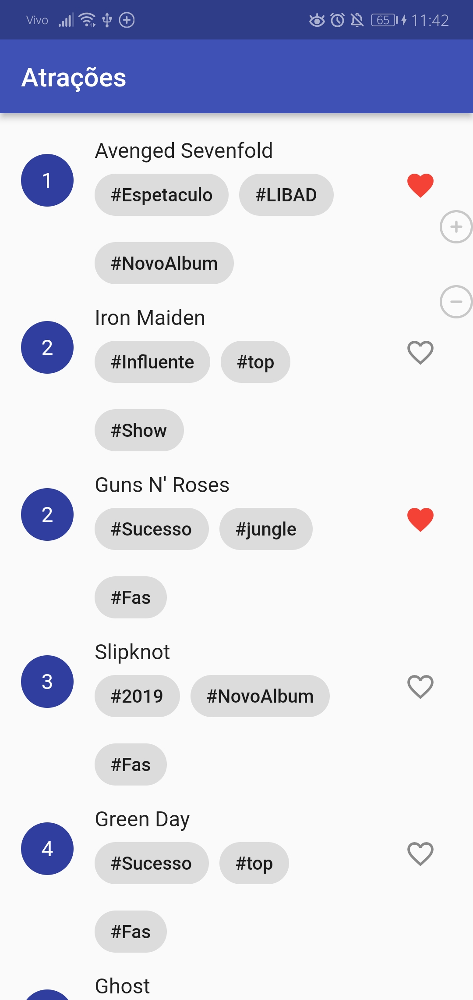
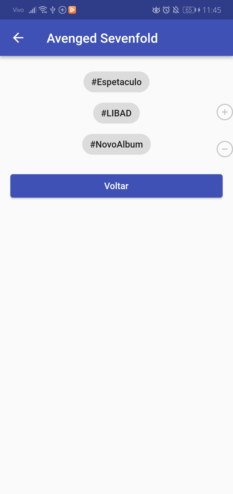

# Rock in Rio App 📱

> 🤘 Repositório de desenvolvimento de um aplicativo mobile de atrações do Rock in Rio utilizando Flutter.

## Imagens do projeto

  
  
  

## Autor
👤 **Pedro Henrique**
* Github: [@PedroHenriquebc](https://github.com/PedroHenriquebc)
* LinkedIn: [Pedro Henrique Barros da Costa](https://www.linkedin.com/in/pedro-henriquebc/)

## Mostre seu apoio

Dê uma ⭐️ se você gostou deste projeto!
