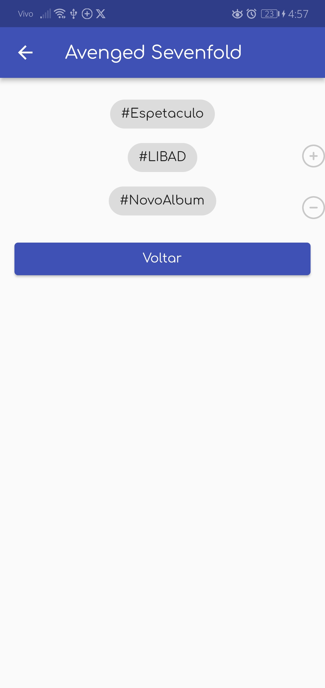
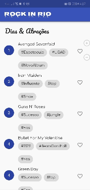

# Rock in Rio App

> Repositório de desenvolvimento de um aplicativo mobile de atrações do Rock in Rio utilizando Flutter 🤘

 

### 📌 Imagens

  
  

 

### 📌 Gif

 

### 🚧 Work in progress!
Esta é uma versão inicial, o projeto ainda está em desenvolvimento e sujeito à mudanças 

 

### Autor
👤 **Pedro Henrique**
* Github: [@PedroHenriquebc](https://github.com/PedroHenriquebc)
* LinkedIn: [Pedro Henrique Barros da Costa](https://www.linkedin.com/in/pedro-henriquebc/)

 

## Mostre seu apoio
Dê uma ⭐️ se você gostou deste projeto!
